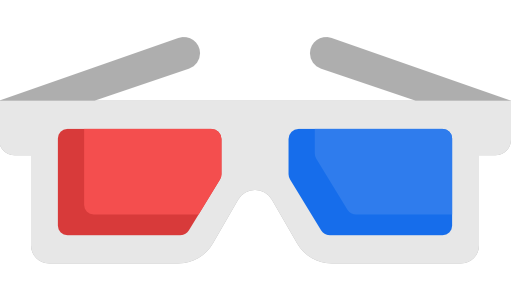

#   Android app for zFilm-HD

## About app 📜

* This application is created exclusively for training.
* The goal was to learn the basics of working with React Native, Expo and the Native Base component library. 
* [WebView](./docs/web-view.jpg) was used to display the video player.

## Preview:

## Thanks for icons 👏 Freepik:

Icons made by <a href="https://www.flaticon.com/authors/freepik" title="Freepik">Freepik</a> from <a href="https://www.flaticon.com/" title="Flaticon"> www.flaticon.com</a>